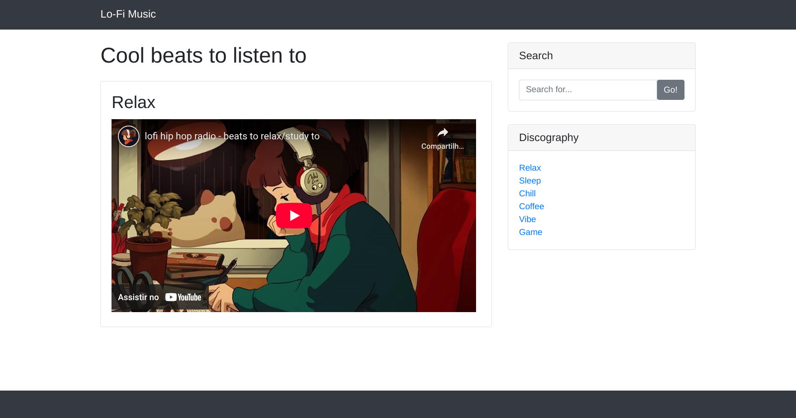
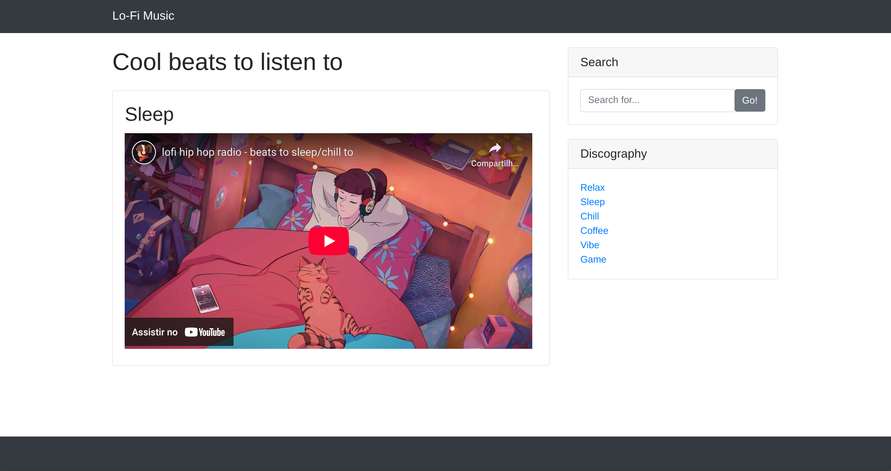
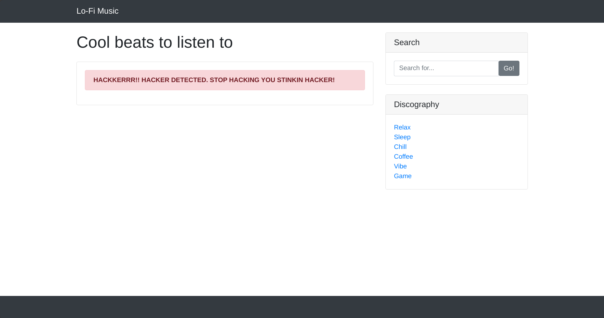
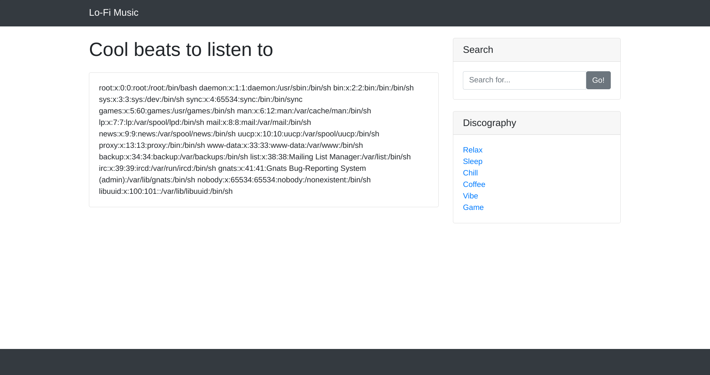
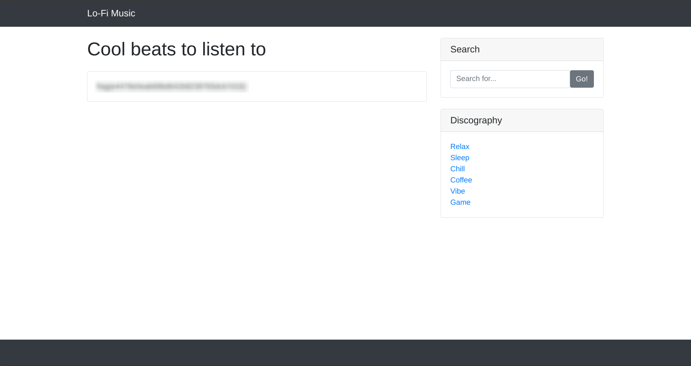

# Lo-Fi

<p align="center">
  
</p>

> *Want to hear some lo-fi beats, to relax or study to? We've got you covered!*

<br>

## 🧠 Intro
Welcome to **Lo-Fi**, where we’ll be exploring **Local File Inclusion (LFI)**. This vulnerability happens when an application allows users to include files on the server through the browser — usually due to unsafe handling of URL parameters.  

*Get into the Lo-Fi vibe and deploy your machine!* 🎧

<br>

## 🎯 Task
To pwn this room, we need to:

- Capture the **flag**.  
  
*Let’s see what we can uncover.* 🔍

<br> 

## 🔍 Recon
We start off by visiting the machine’s IP in the browser:

> http://MACHINE_IP



We’re greeted with a chill video page and some categories on the side. Out of curiosity, we click on one — `sleep`.

That takes us to:

> http://MACHINE_IP/?page=sleep.php



Hmm. That URL looks interesting. `page=sleep.php`? Looks like the server is including files based on that parameter. 🤔

So... what if we try something like:

> http://MACHINE_IP/?page=/home



Bingo. We get a message telling us to stop hacking.

*Sorry, that’s not gonna happen.* 😎

<br>

## 🧪 Exploitation (LFI)
Time to test a classic LFI payload:

> `../../../../etc/passwd`

So we go to:

> http://MACHINE_IP/?page=../../../../etc/passwd



Boom! We get the contents of `/etc/passwd` on the page. That's a confirmed LFI vulnerability.

Let’s look for our flag. Common sense says it might be in the root directory:

> http://MACHINE_IP/?page=../../../../flag.txt



And there it is!

<br>

## 🏁 Got the Flag
On the root directory, we find our flag.

```
flag{go_get_it}
```

*Easy, breezy, breech-y.* 😌  
 
<br>

## 📝 Notes
This room shows how a seemingly harmless parameter can be a serious entry point. If you allow file paths to be loaded from user input, make sure to sanitize and restrict that input.

<br>

## 🏠 Room Info
- 🧩 [TryHackMe - Lo-Fi](https://tryhackme.com/room/lofi)
- 🏷️ Difficulty: Easy
- 🧠 Focus: LFI (Local File Inclusion)
