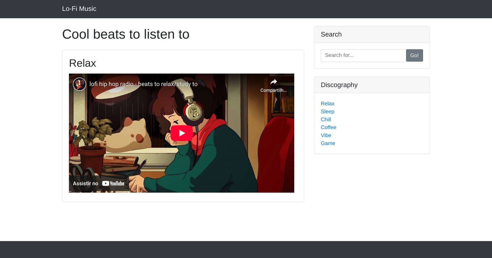
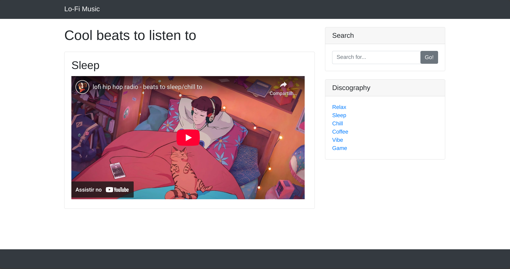
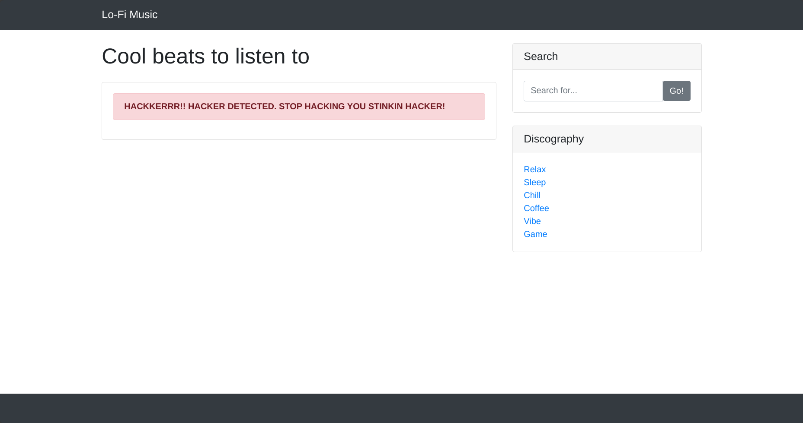
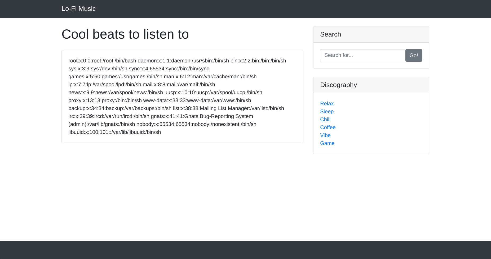
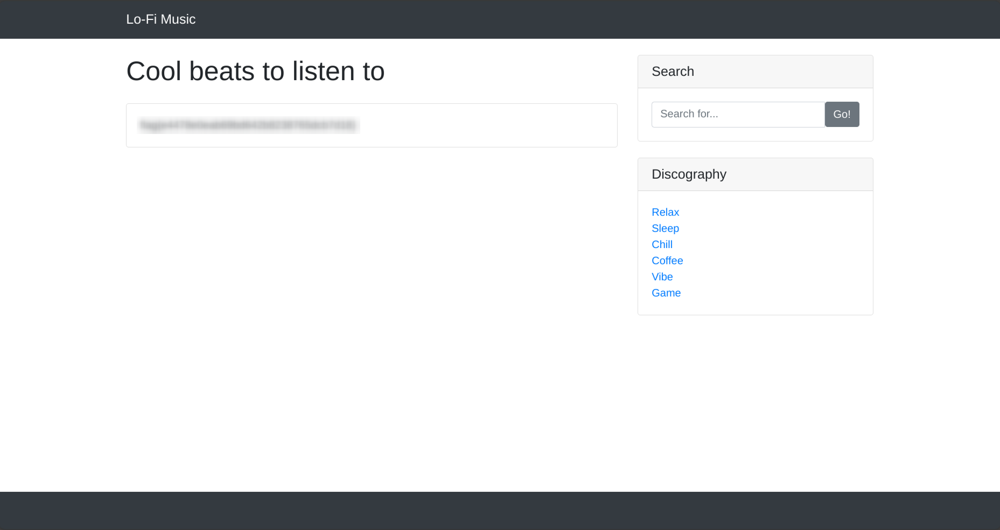

# Lo-Fi

<p align="center">
  
</p>

> *Want to hear some lo-fi beats, to relax or study to? We've got you covered!*

<br>

## ./overview

**Lo-Fi** is a TryHackMe room focused on **Local File Inclusion (LFI)**. The challenge demonstrates how insecure handling of user-controlled file paths allows an attacker to access arbitrary files stored on the target system.

This document describes the reconnaissance, exploitation process, and security implications of the vulnerability.

<br>

## ./objective

* Identify the Local File Inclusion vulnerability.
* Read arbitrary files from the target system.
* Capture the room flag.

<br>

## ./reconnaissance

After deploying the machine, navigate to the target application:

> http://MACHINE_IP



The application displays a webpage containing several music categories.

Selecting the **sleep** category redirects the browser to:

> http://MACHINE_IP/?page=sleep.php



The presence of the `page` parameter suggests that the application dynamically includes files based on user input, making it a potential candidate for Local File Inclusion testing.

To verify this behavior, a simple path is supplied as the parameter value:

> http://MACHINE_IP/?page=/home



Although the request does not disclose sensitive information, the application's response confirms that user-controlled file paths are being processed.

<br>

## ./vulnerability_analysis

A standard directory traversal payload is used to determine whether arbitrary files can be accessed:

```text
../../../../etc/passwd
```

The resulting request becomes:

> http://MACHINE_IP/?page=../../../../etc/passwd



The application successfully returns the contents of `/etc/passwd`, confirming the presence of a **Local File Inclusion (LFI)** vulnerability.

Since arbitrary files can be read, the next step is to locate the room flag.

<br>

## ./data_extraction

A common location for challenge flags is the root directory.

Requesting:

> http://MACHINE_IP/?page=../../../../flag.txt

returns the expected file.



The response contains the room flag.

<br>

## ./flag

```text
flag{********}
```

<br>

## ./conclusion

This room demonstrates how insufficient validation of file path parameters can expose sensitive files on the underlying operating system.

Local File Inclusion vulnerabilities allow attackers to read arbitrary files and, depending on the application configuration, may lead to further exploitation such as information disclosure or even remote code execution.

Restricting file access to predefined resources, validating user input, and avoiding direct inclusion of client-supplied paths are fundamental practices for preventing LFI vulnerabilities.

---

<p align="center">
  <sub>© 2026 0xf0xy • For educational purposes only.</sub>
</p>
