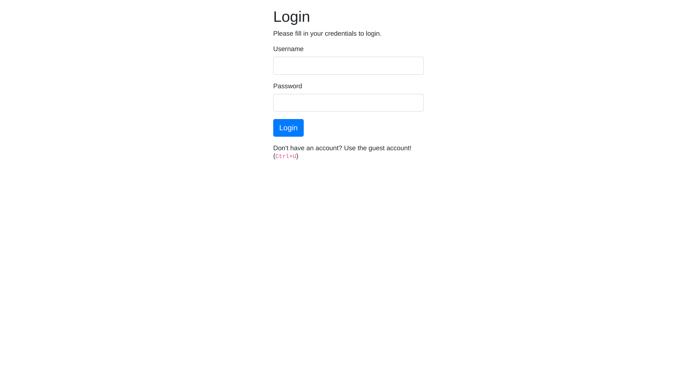
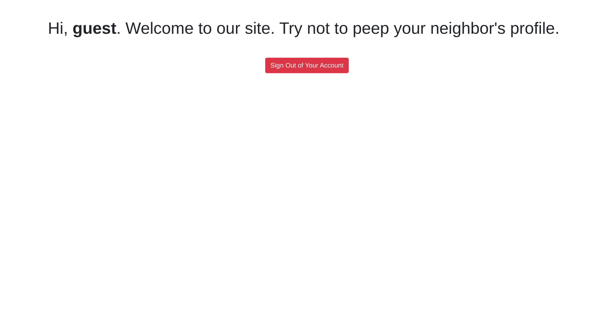
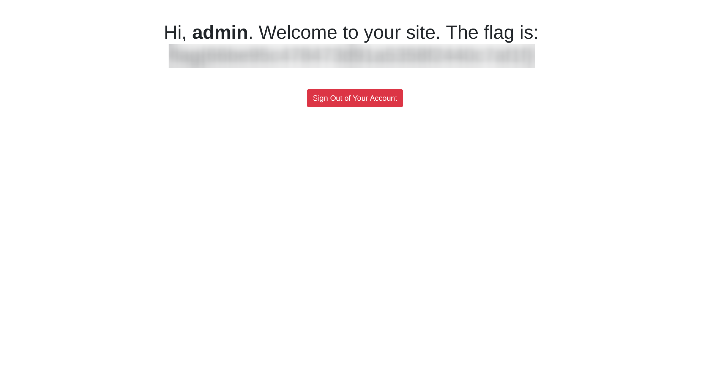

# Neighbour

<p align="center">
  
</p>

> ***Check out our new cloud service, Authentication Anywhere. Can you find other user's secrets?***

<br>

## 🧠 Intro
Welcome to **Neighbour**, where we’ll be exploring **IDOR (Insecure Direct Object Reference)**. This vulnerability allows users to access someone else’s data just by modifying a simple URL. 

*So let's deploy the machine and start Hacking!* 😎  

<br>

## 🔍 Recon
*Let’s see what we’re dealing with...* 🤔

After deploying the machine, we visit the IP in the browser:

> http://MACHINE_IP



We’re welcomed with a basic login page. Below the form there's a helpful tip:

> *"Don't have an account? Use the guest account! <br>
> (Ctrl+U)"*

So we hit `Ctrl+U` to peek at the HTML source and find this little gem:

```html
<!-- use guest:guest credentials until registration is fixed. "admin" user account is off limits!!!!! -->
```

Nice! Time to login.

<br>

## 🔑 Logging In
We log in with the credentials:

> Username: guest <br>
> Password: guest

Boom. We're redirected to:

> http://MACHINE_IP/profile.php?user=guest



And hey — the user parameter is sitting right there in the URL. Suspicious.

*Classic vulnerability vibes right here.* 😌

<br>

## 🧪 Exploitation (IDOR)
Let’s test if we can mess with that user value.

So we swap guest with admin:

> http://MACHINE_IP/profile.php?user=admin



And it works! We get access to the admin profile without needing admin creds. That’s classic IDOR in action.

*Never trust the user.* 😉

<br>

## 🏁 Got the Flag
On the admin profile page, we find our flag.

```
flag{go_get_it}
```

*Boom! Easy win.* 💥

<br>

## 🎯 Takeaway
This room is a nice reminder that just hiding stuff isn’t security. Always make sure your app checks permissions server-side. Never trust users to only access what they should.

<br>

## 🏠 Room Info
- 🧩 [TryHackMe - Neighbour](https://tryhackme.com/room/neighbour)
- 🏷️ Difficulty: Easy
- 🧠 Focus: IDOR (Insecure Direct Object Reference)
