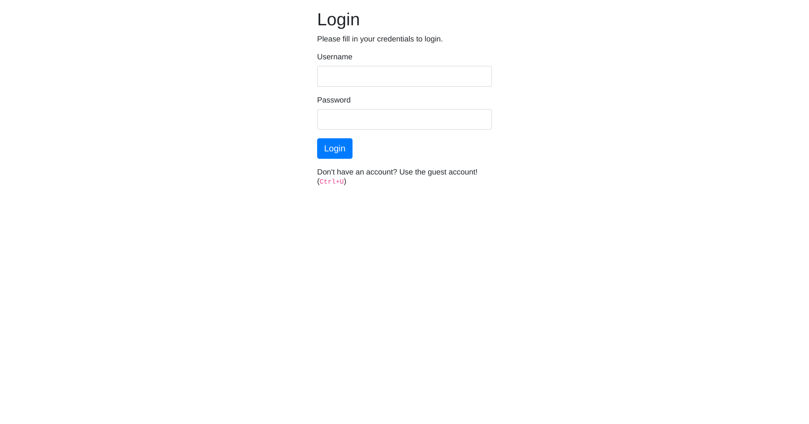
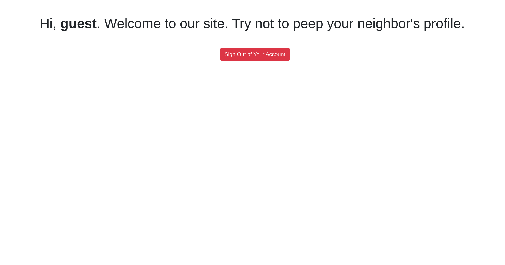
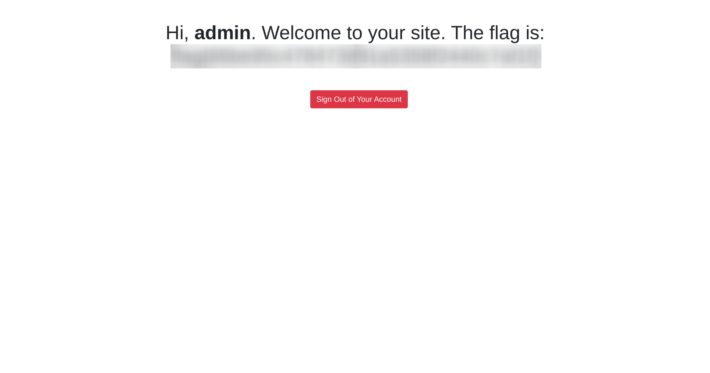

# Neighbour

<p align="center">
  
</p>

> *Check out our new cloud service, Authentication Anywhere. Can you find other user's secrets?*

<br>

## ./overview

**Neighbour** is a TryHackMe room focused on **Insecure Direct Object Reference (IDOR)**. The challenge demonstrates how missing authorization checks allow an attacker to access resources belonging to other users simply by manipulating object identifiers exposed by the application.

This document describes the reconnaissance, exploitation process, and security implications of the vulnerability.

<br>

## ./objective

* Identify the IDOR vulnerability.
* Access the administrator profile.
* Capture the room flag.

<br>

## ./reconnaissance

After deploying the machine, navigate to the target application:

> http://MACHINE_IP



The application presents a standard login interface.

A message displayed below the login form suggests inspecting the page source:

> *Don't have an account? Use the guest account!*
> *(Ctrl+U)*

Viewing the HTML source reveals the following developer comment:

```html
<!-- use guest:guest credentials until registration is fixed. "admin" user account is off limits!!!!! -->
```

The comment discloses valid guest credentials, allowing authentication without prior registration.

<br>

## ./authentication

Authenticate using the disclosed credentials:

> **Username:** `guest`
> **Password:** `guest`

Successful authentication redirects the user to:

> http://MACHINE_IP/profile.php?user=guest



The authenticated username is exposed through the `user` query parameter, suggesting that profile selection relies on a client-controlled identifier.

This behavior makes the endpoint a strong candidate for authorization testing.

<br>

## ./vulnerability_analysis

Replacing the value of the `user` parameter with another username:

> http://MACHINE_IP/profile.php?user=admin

produces the following result:



The application grants access to the administrator profile without verifying whether the authenticated user is authorized to access the requested resource.

This confirms the presence of an **Insecure Direct Object Reference (IDOR)** vulnerability caused by missing server-side authorization checks.

<br>

## ./flag

The administrator profile contains the room flag.

```text
flag{********}
```

<br>

## ./conclusion

This room highlights the importance of implementing authorization checks independently of client-supplied data.

Although object identifiers such as usernames or numeric IDs are commonly exposed within applications, access control must always be enforced on the server side. Trusting user-controlled parameters without validating ownership or permissions can lead to unauthorized disclosure of sensitive information.

Proper authorization mechanisms are the primary defense against IDOR vulnerabilities.

---

<p align="center">
  <sub>© 2026 0xf0xy • For educational purposes only.</sub>
</p>
